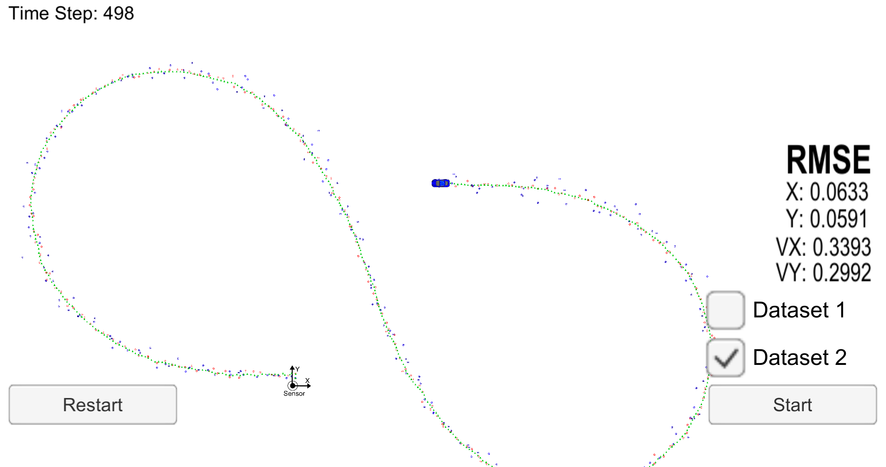

# Unscented Kalman Filter Project Starter Code
Self-Driving Car Engineer Nanodegree Program

In this project utilize an Unscented Kalman Filter to estimate the state of a moving object of interest with noisy lidar and radar measurements. Passing the project requires obtaining RMSE values that are lower that the tolerance outlined in the project rubric. 

This project involves the Term 2 Simulator which can be downloaded [here](https://github.com/udacity/self-driving-car-sim/releases)

This repository includes two files that can be used to set up and intall [uWebSocketIO](https://github.com/uWebSockets/uWebSockets) for either Linux or Mac systems. For windows you can use either Docker, VMware, or even [Windows 10 Bash on Ubuntu](https://www.howtogeek.com/249966/how-to-install-and-use-the-linux-bash-shell-on-windows-10/) to install uWebSocketIO. Please see [this concept in the classroom](https://classroom.udacity.com/nanodegrees/nd013/parts/40f38239-66b6-46ec-ae68-03afd8a601c8/modules/0949fca6-b379-42af-a919-ee50aa304e6a/lessons/f758c44c-5e40-4e01-93b5-1a82aa4e044f/concepts/16cf4a78-4fc7-49e1-8621-3450ca938b77) for the required version and installation scripts.

Once the install for uWebSocketIO is complete, the main program can be built and ran by doing the following from the project top directory.

1. mkdir build
2. cd build
3. cmake ..
4. make
5. ./UnscentedKF

Tips for setting up your environment can be found [here](https://classroom.udacity.com/nanodegrees/nd013/parts/40f38239-66b6-46ec-ae68-03afd8a601c8/modules/0949fca6-b379-42af-a919-ee50aa304e6a/lessons/f758c44c-5e40-4e01-93b5-1a82aa4e044f/concepts/23d376c7-0195-4276-bdf0-e02f1f3c665d)

Note that the programs that need to be written to accomplish the project are src/ukf.cpp, src/ukf.h, tools.cpp, and tools.h

The program main.cpp has already been filled out, but feel free to modify it.

Here is the main protcol that main.cpp uses for uWebSocketIO in communicating with the simulator.


INPUT: values provided by the simulator to the c++ program

["sensor_measurement"] => the measurment that the simulator observed (either lidar or radar)


OUTPUT: values provided by the c++ program to the simulator

["estimate_x"] <= kalman filter estimated position x
["estimate_y"] <= kalman filter estimated position y
["rmse_x"]
["rmse_y"]
["rmse_vx"]
["rmse_vy"]

---

## Other Important Dependencies
* cmake >= 3.5
  * All OSes: [click here for installation instructions](https://cmake.org/install/)
* make >= 4.1 (Linux, Mac), 3.81 (Windows)
  * Linux: make is installed by default on most Linux distros
  * Mac: [install Xcode command line tools to get make](https://developer.apple.com/xcode/features/)
  * Windows: [Click here for installation instructions](http://gnuwin32.sourceforge.net/packages/make.htm)
* gcc/g++ >= 5.4
  * Linux: gcc / g++ is installed by default on most Linux distros
  * Mac: same deal as make - [install Xcode command line tools](https://developer.apple.com/xcode/features/)
  * Windows: recommend using [MinGW](http://www.mingw.org/)

## Basic Build Instructions

1. Clone this repo.
2. Make a build directory: `mkdir build && cd build`
3. Compile: `cmake .. && make`

## Running the Filter
In your build directory run it: `./UnscentedKF `. The output should be:

```
Listening to port 4567
```
You need to start the Term 2 simulator. If the simulator is running, the filter should be able to connect to it and the output should be:

```
Listening to port 4567
Connected!!!
```
Here is the simulator window when just started:


The simulator provides two datasets. The difference between them are:

- The direction the car is moving.
- The order the first measurement is sent to the UKF. On dataset 1, the LIDAR measurement is sent first. On the dataset 2, the RADAR measurement is sent first.

Here is the result after running the UKF with the Dataset 1:


And here is the result after running the UKF with the Dataset 2:



# [Rubric](https://review.udacity.com/#!/rubrics/783/view) points

## Compiling

### Your code should compile

The code compiles without errors with `cmake` and `make` but only has been tested on Mac OS.

## Accuracy

### px, py, vx, vy output coordinates must have an RMSE <= [.09, .10, .40, .30] when using the file: "obj_pose-laser-radar-synthetic-input.txt", which is the same data file the simulator uses for Dataset 1."

The EKF accuracy was:

- Dataset 1 : RMSE <= [0.0605, 0.0862, 0.3299, 0.2131]
- Dataset 2 : RMSE <= [0.0633, 0.0591, 0.3393, 0.2992]

## Follows the Correct Algorithm

### Your Sensor Fusion algorithm follows the general processing flow as taught in the preceding lessons

The Sensor Fusion algorithm is implemented in the [`ProcessMeasurement` (src/ukf.cpp)](./src/ukf.cpp#L105) method and follows the general processing flow in lines [161](./src/ukf.cpp#L161) through [171](./src/ukf.cpp#L171).

### Your Kalman Filter algorithm handles the first measurements appropriately

The first measurement is handled in the [`ProcessMeasurement` (src/ukf.cpp)](./src/ukf.cpp#L105) method in lines [118](./src/ukf.cpp#L118) through [151](./src/ukf.cpp#L151) and takes into account different sensor types in the incoming measurements as well as usage of a single sensor only.

### Your Kalman Filter algorithm first predicts then updates

Upon receiving a measurement after the first, the algorithm predicts object position to the current timestep at [src/ukf.cpp](./src/ukf.cpp#L161) line [161](./src/ukf.cpp#L161) and then updates the prediction using the new measurement at lines [168](./src/ukf.cpp#L168) and [170](./src/ukf.cpp#L170).

### Your Kalman Filter can handle radar and lidar measurements

Different types of measurements are handled in two places in [src/ukf.cpp](./src/ukf.cpp):

- For the first measurement in lines [119](./src/ukf.cpp#L119) through 149.
- For the update part in lines [167](./src/ukf.cpp#L167) through 171.

## Code Efficiency

### Your algorithm should avoid unnecessary calculations

My intention was to write the code as close as possible to how it was taught in the lectures. I did sacrifice the efficiency a bit over the general flow understanding and do have a bit of redundant calculations in a few places. For example three for loops in lines [346](./src/ukf.cpp#L346) through 372 in [src/ukf.cpp](./src/ukf.cpp) can be combined into one but the Kalman filter steps woudn't be that distinguishable.

## Comparison between EKF and UKF and a single data source for UKF

### Dataset 1
| RMSE |  EKF   |   UKF   | UKF LIDAR only | UKF RADAR only |
|:-------:|:-------:|:--------:|:-------------------:|:--------------------:|
|     X    | 0.0973 | 0.0605 |          0.1003       |          0.1601         |
|     Y    | 0.0855 | 0.0862 |          0.0981       |          0.2011         |
|    VX   | 0.4513 | 0.3299 |          0.6058       |          0.3325         |
|    VY   | 0.4399 | 0.2131 |          0.2391       |          0.4712         |

### Dataset 2
| RMSE |  EKF   |   UKF   | UKF LIDAR only | UKF RADAR only |
|:-------:|:-------:|:--------:|:-------------------:|:--------------------:|
|     X    | 0.0726 | 0.0633 |          0.0998       |        0.1861           |
|     Y    | 0.0965 | 0.0591 |          0.0813       |        0.2121           |
|    VX   | 0.4216 | 0.3393 |          0.5969       |        0.3903           |
|    VY   | 0.4932 | 0.2992 |          0.2786       |        0.5127           |

As it can be clearly seen UKF outperforms EKF. Even using a single data source the UKF performs relatively good and very close to the EKF performance, especially with the LIDAR sensor.

## Normalized Innovation Squared (NIS)
Measurement noise parameters were not changed from the originally provided but the consistency check with the help of NIS values shows that we estimate the uncertainty of our system correctly. The green line in the images is 95% of our NIS distribution which is called Chi-squared distribution. For the Lidar we have 2 DOF and in this case our NIS values in 95% cases will be between 0 and 5.991. Radar has 3 DOF, so in 95% of the cases our NIS will be between 0 and 7.815.

Expected NIS values:


Our computed NIS for Lidar:


Our computed NIS for Radar:


